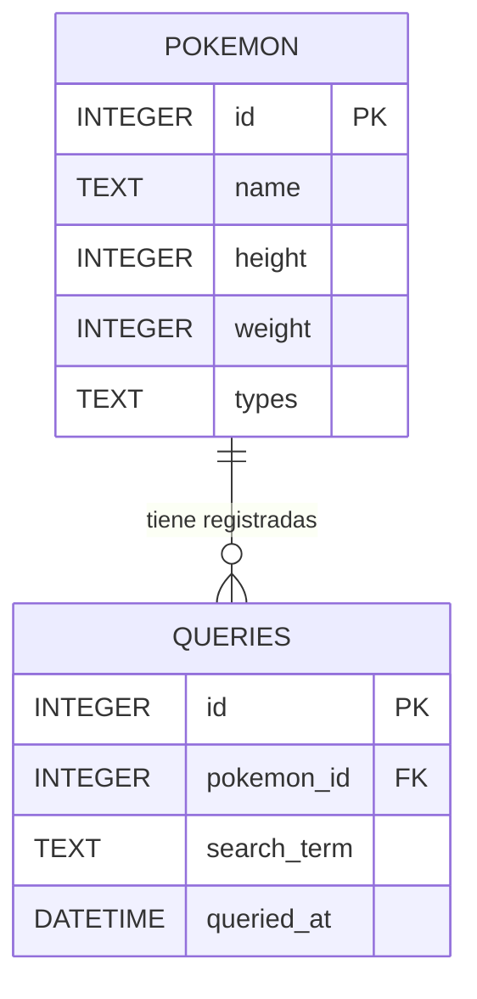

### Diagrama Entidad-Relación

```mermaid
erDiagram
    POKEMON ||--o{ QUERIES : "tiene registradas"
    
    POKEMON {
        INTEGER id PK
        TEXT name
        INTEGER height
        INTEGER weight
        TEXT types
    }
    
    QUERIES {
        INTEGER id PK
        INTEGER pokemon_id FK
        TEXT search_term
        DATETIME queried_at
    }
```

### Diagrama de Arquitectura

