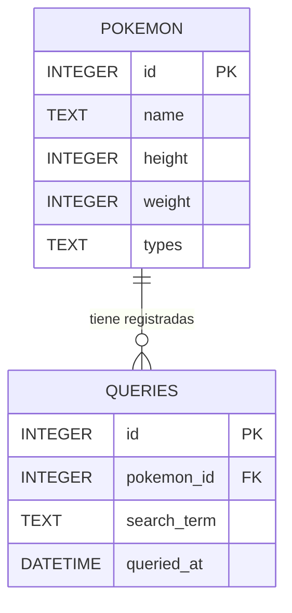

### Diagrama Entidad-Relación

### Diagrama de Arquitectura

#Ejecución con Docker

Este proyecto está contenerizado para garantizar un entorno de desarrollo y producción consistente. Asegúrate de tener el motor de Docker encendido antes de ejecutar los siguientes comandos.

1. Construir la imagen de Docker
Para compilar la imagen con todas las dependencias necesarias de Python y FastAPI, ejecuta en la raíz del proyecto:

docker build -t pokemon-api .
2. Levantar el contenedor
Para iniciar la API en segundo plano y asegurar la persistencia de la base de datos (SQLite) mediante un volumen, ejecuta:

docker run -d --name mi-poke-api -p 8000:8000 -v pokemon-data:/app pokemon-api
Nota: El puerto 8000 de la máquina local quedará enlazado al puerto 8000 del contenedor.

3. Acceder a la API
Una vez que el contenedor esté corriendo, la documentación interactiva (Swagger UI) estará disponible en:

http://localhost:8000/docs

4. Ejecutar las pruebas unitarias (Pytest)
Para correr la suite de pruebas aislando la ejecución dentro del entorno del contenedor, utiliza:

docker exec mi-poke-api python -m pytest -v

5. Detener el contenedor
Cuando termines de trabajar, puedes apagar el contenedor con:

docker stop mi-poke-api

(Para volver a iniciarlo sin perder los datos, usa docker start mi-poke-api)
